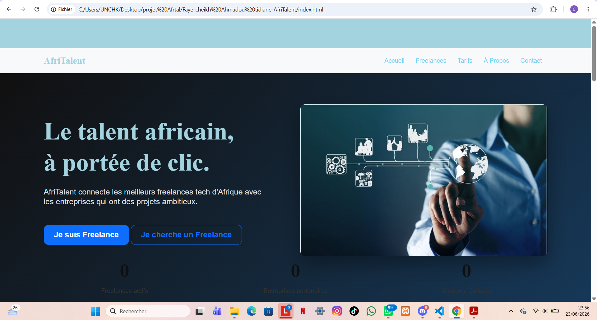

# AfriTalent
Projet fil rouge — Plateforme de mise en relation entre freelances africains et
clients.
Auteur : cheikh ahmadou tidiane faye
Promotion : L1 iage — ISI
# AfriTalent 🌍

## Informations
- **Nom :** Cheikh Ahmadou Tidiane Faye 
- **Classe :** L1 iage
- **Année :** 2025-2026

## Description
AfriTalent est une plateforme fictive de mise en relation entre freelances tech africains et entreprises. Ce site vitrine présente la plateforme, ses fonctionnalités, ses tarifs et des profils de freelances, dans le but de convaincre les visiteurs de s'inscrire.

## Technologies utilisées
- HTML5 sémantique
- CSS3 (Flexbox, Grid, Bento Grid, animations)
- Bootstrap 5
- JavaScript vanilla (ES6)
- Git & GitHub Pages
- Google Fonts (Playfair Display + Inter)
- Bootstrap Icons

## Fonctionnalités principales
- Dark mode / Light mode (sauvegardé en localStorage)
- Compteurs animés au scroll (IntersectionObserver)
- Filtrage dynamique des freelances par catégorie
- Validation complète du formulaire de contact
- Navbar dynamique au scroll
- Bouton retour en haut
- Animations fade-in au scroll
- Design responsive (mobile, tablette, desktop)

## Captures d'écran

## Lancer le projet localement
1. Clonez le dépôt : `git clone https://github.com/mamoufaye39-pixel/Faye-cheikh-Ahmadou-tidiane-AfriTalent.git`
2. Ouvrez le dossier dans VS Code
3. Ouvrez `index.html` avec Live Server

## Lien GitHub Pages
🔗 [Voir le site en ligne](https://mamoufaye39-pixel.github.io/Faye-cheikh-Ahmadou-tidiane-AfriTalent/)

## Ressources consultées
- [MDN Web Docs](https://developer.mozilla.org/fr/)
- [Bootstrap 5 Docs](https://getbootstrap.com/docs/5.3/)
- [Google Fonts](https://fonts.google.com/)
- [Bootstrap Icons](https://icons.getbootstrap.com/)
- [CSS-Tricks](https://css-tricks.com/)
- [W3C Validator](https://validator.w3.org/)
- [Unsplash](https://unsplash.com/) / [Pexels](https://pexels.com/)